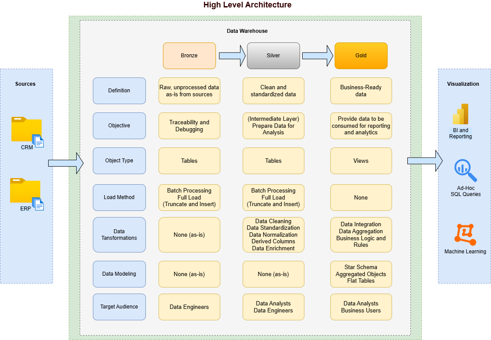

# noak-data-warehouse
Constructing a contemporary data warehouse that spans multiple databases, with complete ETL pipelines, structured data models, and robust analytics tools.

---

## Project Overview

This project involves:

1. **Data Architecture**: Designing a Modern Data Warehouse Using Medallion Architecture **Bronze**, **Silver**, and **Gold** layers.
2. **ETL Pipelines**: Extracting, transforming, and loading data from source systems into the warehouse.
3. **Data Modeling**: Developing fact and dimension tables optimized for analytical queries.
4. **Analytics & Reporting**: Creating SQL-based reports and dashboards for actionable insights.
---

## Architecture

The architecture for this project follows Medallion Architecture **Bronze**, **Silver**, and **Gold** layers: 

1. **Bronze Layer**: Stores raw data as-is from the source systems. Data is ingested from CSV Files into the database.
2. **Silver Layer**: This layer includes data cleansing, standardization, and normalization processes to prepare data for analysis.
3. **Gold Layer**: Houses business-ready data modeled into a star schema required for reporting and analytics.

## Issues

If you notice any problems with running this, please open an
issue [here](https://github.com/bclasky1539/noak-data-warehouse/issues).

## Contributing to the Project

- We welcome contributions through forking the repository to address issues or implement new features.
- Please include appropriate test coverage for all submitted code.
- After submission, your pull request will undergo review and testing before being merged into the main codebase.
